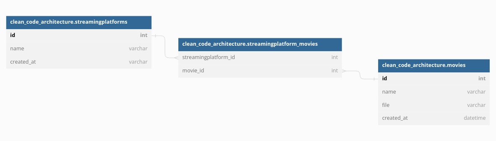

# My comprehension of clean code architecture

# Example used
Movies that are part of a streaming platform, a movie can be part of none to many streaming platforms, in this example you should be able to:
* Create new Movie with these data:
```sh
        "Name": "",
        "File": "url to iamge",
        "Description": "This is a MOVIE",
```
* Get a Movie by ID
* Add a Movie to a platform

## Thech stack
* Go, postgres
* Gin, bun golang ORM, testify, GoMock
* Trying to follow Hexagonal Architechture

## Project structure

```sh
clean-code-architecture/                                 
├── cmd                                 # Entry point for CLI to run our app that could be divided to listeng http, events, etc..
      ├── rest # for our app to listen http requests
      ├── migrations # for our app to run migrations, sql migration files will be placed here
├── controllers                   # requests are comming trough here
            ├── rest                    # controller for rest API technology
├── internal                            # Contains the core of our application
      ├── domain                        # Domain models of our entities
      ├── ports                    # interface definitions/contracts used to communicate with our domain
      ├── services        # entry point to the core
├── repository                    # data storage using a particular technology
├── mocks                               # this contains all mock from any source mock_(source)
├── repository                        
      ├── postgres                      # implementation of the service repository for postgres technology
├── public                              # to store any static file
├── shared                              # A wrap for the context to store the loged user information
```
## How to run
```
docker-compose up
```
## Database
### Entity relationship driagram

## Separation of concerns and dependency injection
* DB layer: Starting from postgres implementation, we use a instance of **db** because the library we are using here didn't provide us of an interface that implemented the creation of a transaction.
* Service layer: The service receives an interface for the repository, meaning that every implementation following this contract should be able to use it
* Controller layer: Uses the service interface

## TODOS
* Apply some dependency injection
* Better error handling
* Round the values of the float for the balances
* Improve input request validation, it has a very basic validation right now
